# Intraday Periodicity and Volatility Persistence, Revisited

**A replication and extension of Andersen & Bollerslev (1997) on modern FX, equity-index and crypto data**

[](pyproject.toml)
[](LICENSE)
[](paper/main.pdf)
<!-- ZENODO-BADGE -->

> **Research question.** Does the deterministic intraday pattern in volatility still distort inference about volatility dynamics, as Andersen & Bollerslev showed in 1997, and does modelling it pay off *out of sample*, for volatility forecasts, for risk management or for trading?

📄 **Paper:** [`paper/main.pdf`](paper/main.pdf) (25 pages) · 📊 **Figures:** [`figures/`](figures) · 📋 **Tables:** [`tables/`](tables) · 🧪 **Notebooks:** [`notebooks/`](notebooks)

---

## Original paper

Andersen, T.G. & Bollerslev, T. (1997). *Intraday periodicity and volatility persistence in financial markets.* **Journal of Empirical Finance** 4(2–3), 115–158. [doi:10.1016/S0927-5398(97)00004-2](https://doi.org/10.1016/S0927-5398(97)00004-2)

The paper models a 5-minute return as

$$R_{t,n} = E(R_{t,n}) + \frac{\sigma_t \, s_{t,n} \, Z_{t,n}}{\sqrt{N}}$$

where:
- $\sigma_t$ is the daily volatility level;
- $s_{t,n}$ is a deterministic **intraday periodic component**, estimated with a Flexible Fourier Form (FFF);
- $Z$ is i.i.d. noise.

Its central finding concerns MA(1)-GARCH(1,1) models fitted to raw intraday returns. Their persistence estimates are wildly inconsistent across sampling frequencies: explosive at 5 minutes, half-lives of a few hours at 1–1.5 hours, weeks at 2 hours and longer. That contradicts temporal-aggregation theory. Coherence returns only after returns are divided by $\hat s$. Their data (Olsen DM–\$ quotes, 1992–93; CME S&P 500 futures, 1986–89) are not public.

## Motivation

"Deseasonalise before you model" became standard practice, but its empirical premise has rarely been re-tested on markets that changed beyond recognition: electronic FX, near-24-hour equity futures, and crypto markets that never close. Practitioners also need to know whether the periodic component matters *out of sample*. Intraday volatility forecasts drive position sizing, execution scheduling, stop placement and margining.

## Key findings

| # | Hypothesis | Verdict | Evidence |
|---|---|---|---|
| H1 | Intraday volatility pattern persists | ✅ **Replicated** | FX trading-centre rotation and the equity U-shape with a post-close drop; year-to-year profile correlation is 0.96 for FX and 0.91 for the S&P |
| H2 | Raw-return GARCH persistence is frequency-inconsistent, and filtering fixes it | ✅ **FX: strongly replicated** · ⚠️ S&P: weak · ❌ BTC: no | EUR/USD: filtering improves consistency in **85% of 20 one-year windows** (Wilcoxon *p* = 0.0002); median lowest raw α+β is **0.09**, filtered **0.87**. S&P: 86% of windows, *p* = 0.018, small effect. BTC: *p* = 0.23 |
| H3 | Volume co-moves with volatility | ✅ BTC (only free volume) | Cross-interval correlation 0.82 (logs); within-day correlation positive on 100% of days |
| H4 | Shape depends on regime, weekday and news | ✅ | S&P last/first-hour volatility rises from 0.755 to 0.810 on high-volatility days (A&B's "J-shape" direction); the 08:30 NY interval is **10.9×** the day's average volatility on payroll Fridays |
| H5 | Mean-return seasonality is not exploitable after costs | ✅ | FDR-surviving intervals: in-sample Sharpe 6.8 → **0.4 out of sample**. Same-interval momentum is significant gross (*t* = 9.0) but breaks even at **0.05 bp** against a 0.6 bp cost |
| H6 | Modelling periodicity improves OOS volatility forecasts | ✅ | Filtered intraday GARCH beats raw intraday GARCH for **all three assets** (DM *t* = −10.7, −20.1, −4.0); risk-targeting error falls from **33% to 8%** (EUR/USD) |
| H7 | BTC shows FX-like patterns, and activity shifted to US hours with the spot ETFs | ⚠️ **Partly** | The US-hours variance share rose (40.8% → 45.2%), but most of the shift happened in **2022–23, before the ETFs**. Attribution to the ETFs is *not* supported |

**Methodological contributions**
- **An undocumented timestamp convention in a widely used free source.** HistData's clock is New York time, not the documented EST. From 2019 it also follows European DST dates. This is detected and corrected week by week, then verified in 75 of 75 year × DST groups and against Dukascopy (correlation 0.998).
- **A zero-robust FFF estimator.** With tick-size prices, about 7% of 5-minute returns are exactly zero, which biases A&B's log-OLS estimator. A **Poisson pseudo-ML** version of the same model fixes this. In Monte Carlo its maximum error is 2–3%, against 9–16% for log-OLS.
- **A practical note on profile estimation.** With long samples, a non-parametric average profile beats a low-order FFF out of sample (DM *t* = +5.6 for EUR/USD). With less data or a shifting pattern (BTC), the FFF wins.

## Visual results

### Replication

**Volatility profiles: A&B Figs. 2 and 6.** EUR/USD follows the global trading-centre rotation, with a spike at the 08:30 NY data releases. The S&P 500 has the U-shape and the post-cash-close collapse at intervals 78–80, exactly as in A&B Fig. 2b.
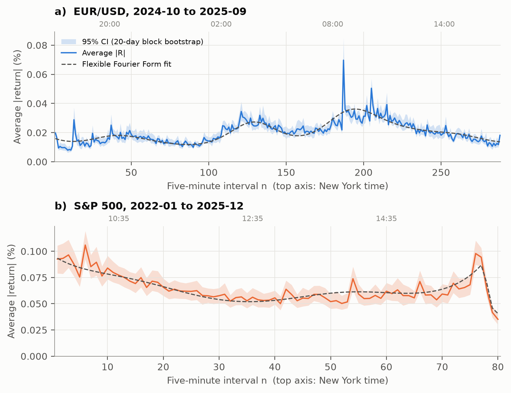

**GARCH persistence across sampling frequencies vs A&B's Tables 2, 4 and 5.**
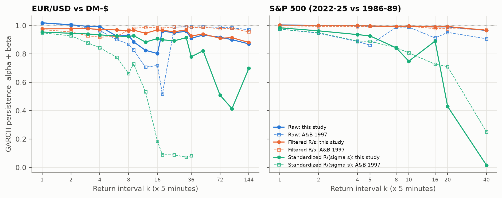

**Correlograms: A&B Fig. 7.** Raw |R| oscillates with a daily period and turns negative half a day apart. Filtering removes the cycle and reveals slow, long-memory decay.
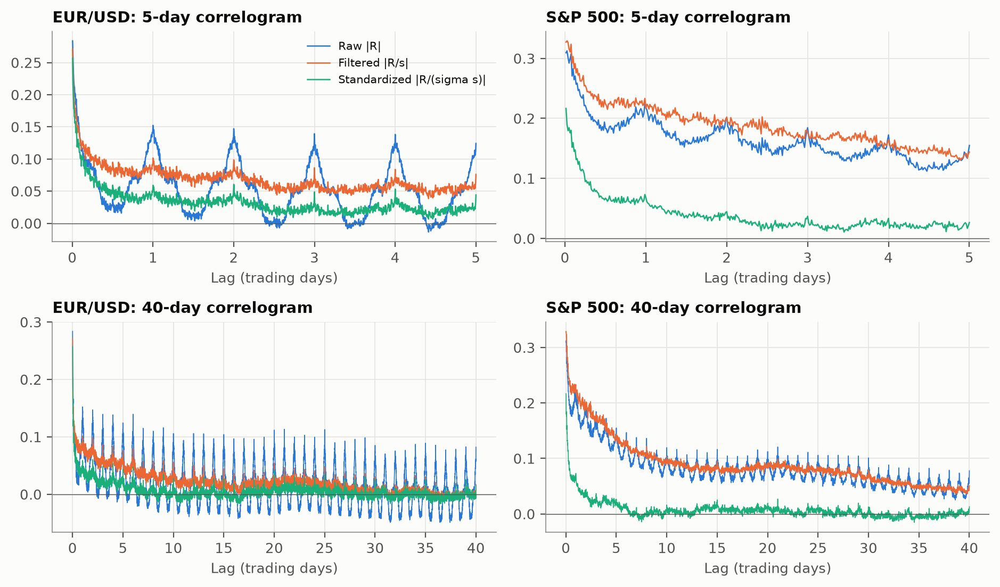

**Robustness across every one-year window.** The headline result for H2.
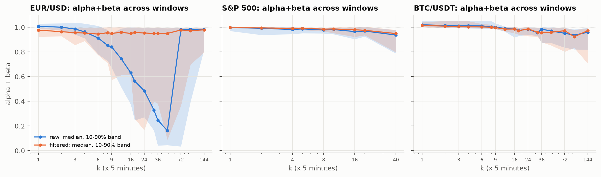

| | |
|---|---|
| 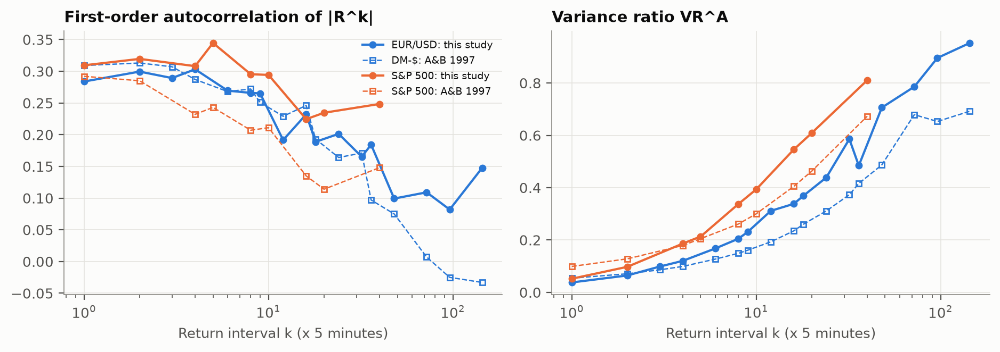 | 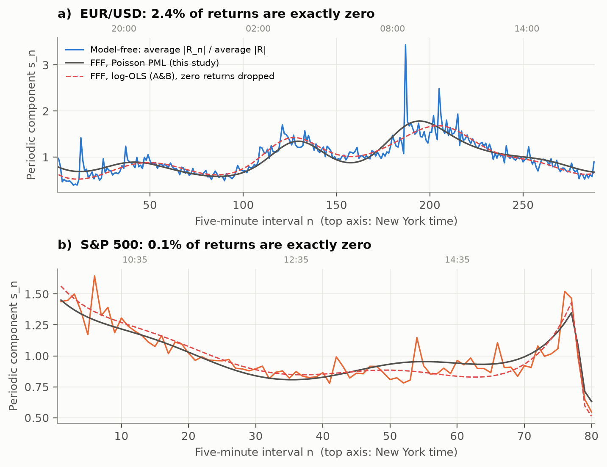 |
| A&B Table 1: ρ₁ᴬ and VRᴬ, this study vs A&B | Periodic component: model-free vs FFF (PPML) vs A&B's log-OLS |

### Extensions

**Cross-asset volatility profiles on a common UTC clock**
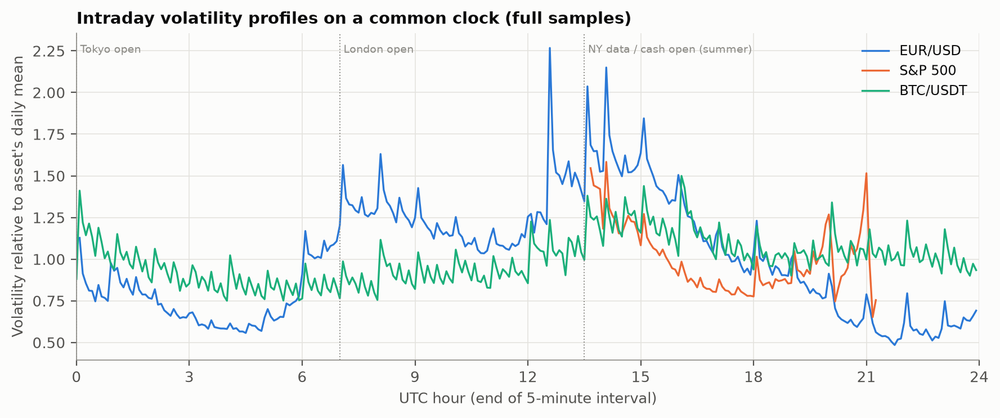

**Time-of-day × day-of-week:** volatility (left) and mean-return *t*-statistics (right)
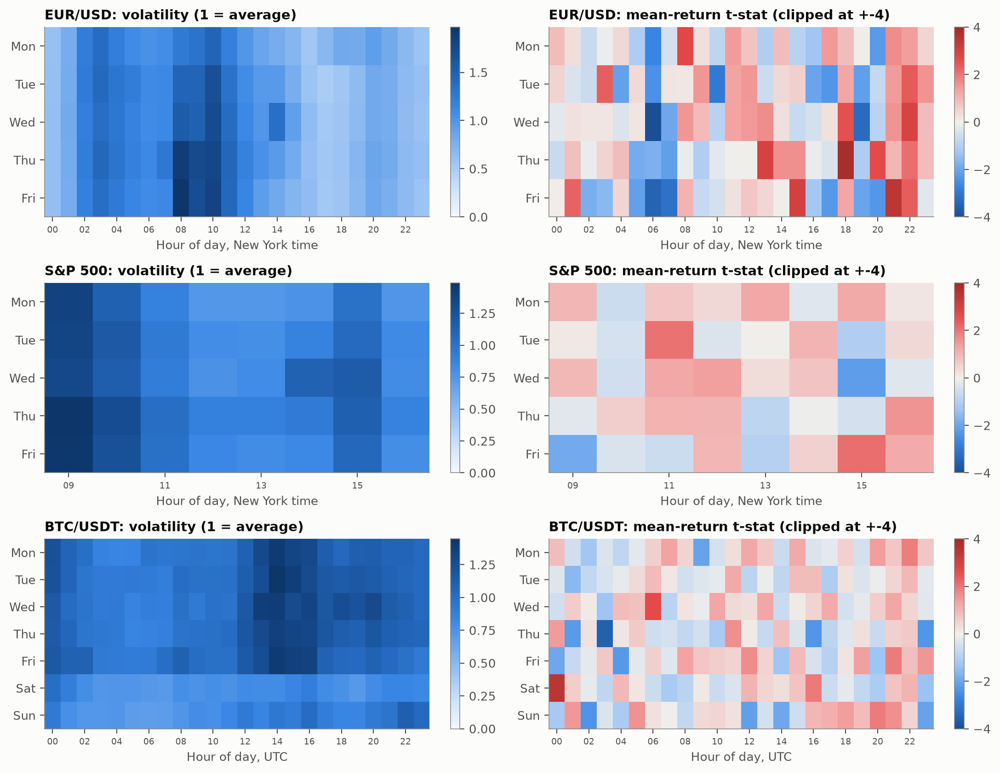

| | |
|---|---|
| 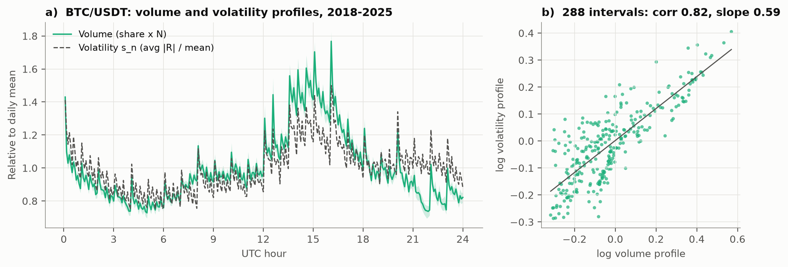 | 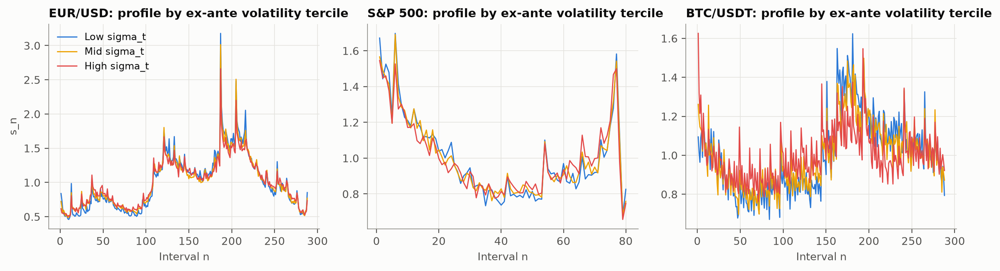 |
| BTC volume vs volatility (H3) | Profile by ex-ante volatility tercile (H4) |
| 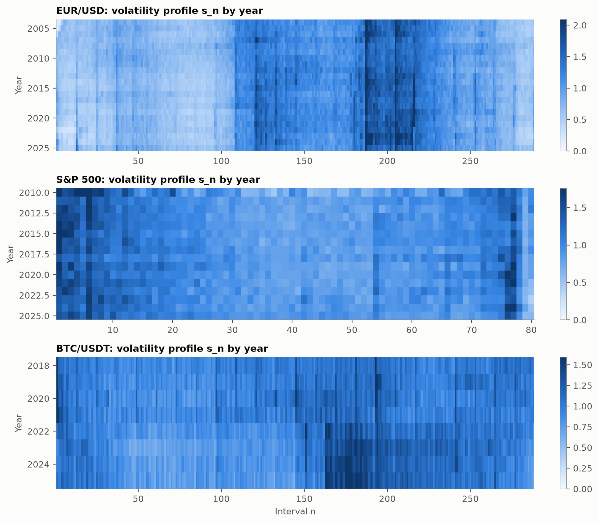 | 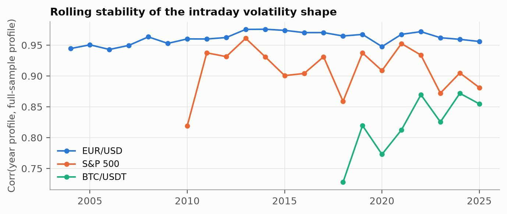 |
| Profile by year | Year-to-year stability of the shape |
| 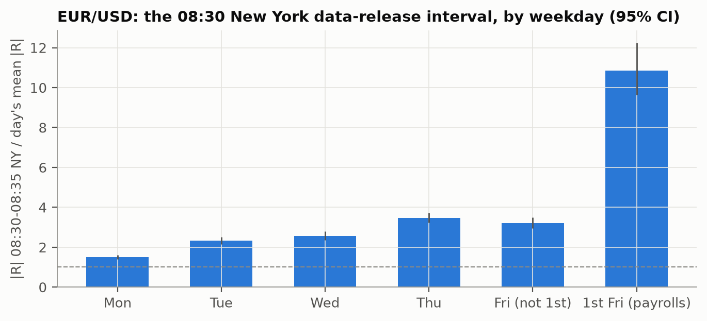 | 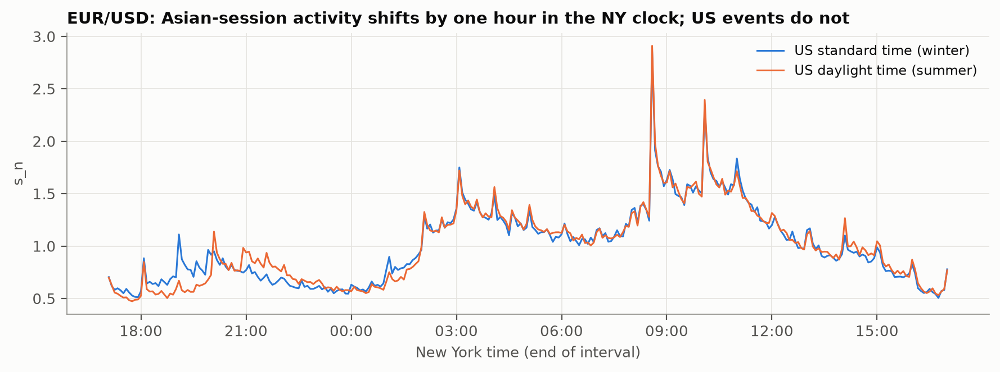 |
| The 08:30 NY announcement interval | EUR/USD under US winter vs summer time |
| 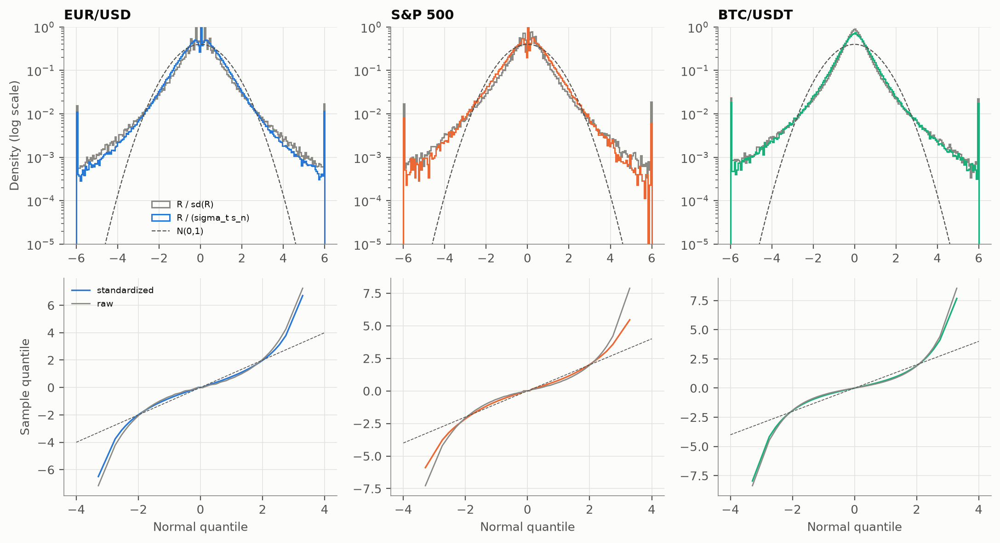 | 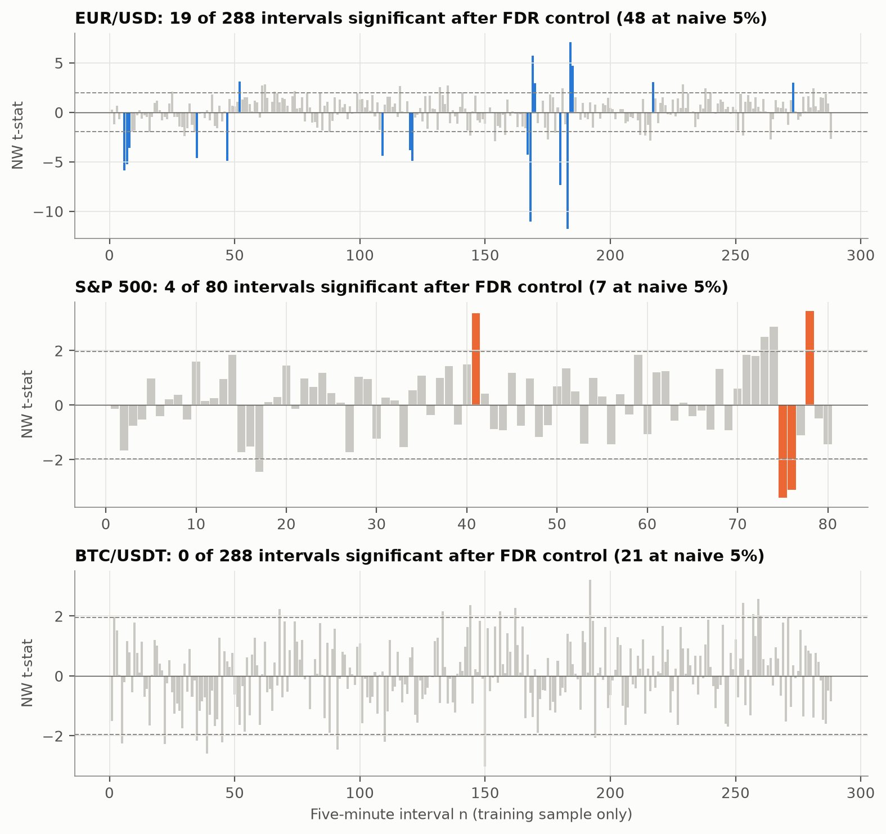 |
| Return distributions, raw vs standardised | Interval mean returns with FDR control |

**BTC: weekend profile and the migration of activity to US hours (H7)**
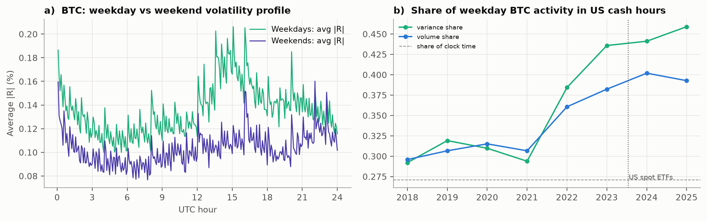

### Out-of-sample

**Walk-forward volatility forecasts (H6).** QLIKE improvement over a flat forecast, with 95% CIs.
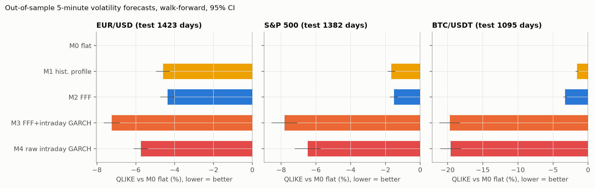

**Risk targeting.** Realised risk relative to target by time of day; 1 means on target.
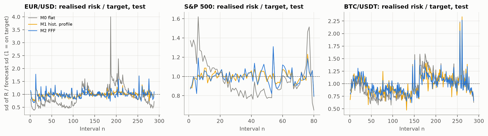

**Mean-return strategies, in-sample vs out-of-sample (H5).** Cumulative *gross* returns; net returns are negative throughout.
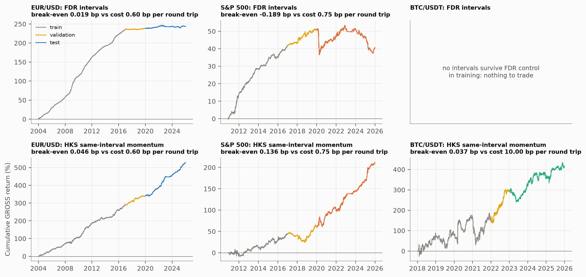

## Dataset

| Asset | Source | Sample | Bars | Notes |
|---|---|---|---|---|
| EUR/USD (DM–\$ successor) | [HistData.com](https://www.histdata.com) 1-min bid | 2004–2025 | 5,446 days × 288 | FX day 17:00–17:00 New York; weekend excluded |
| S&P 500 | HistData.com SPXUSD 1-min (CFD tracking E-mini) | 2010–2025 | 3,649 days × 80 | A&B's window 09:35–16:15 New York |
| BTC/USDT | [Binance public data](https://data.binance.vision) 5-min klines + volume | 2018–2025 | 2,892 days × 288 | 24/7, UTC days |
| Validation | [Dukascopy](https://www.dukascopy.com) 1-min | random days | — | independent cross-check only (rate-limited) |

All sources are free and need no API key. **Data are not redistributed.** `make data` downloads them from the original providers, whose terms of use apply. Data quality is reported in [`tables/data_quality.csv`](tables/data_quality.csv), dropped days with reasons in [`tables/data_dropped_days.csv`](tables/data_dropped_days.csv), and the clock check in [`tables/data_timezone_check.csv`](tables/data_timezone_check.csv).

## Methodology

1. **Returns.** $R_{t,n}=100\,\Delta\log p$ on a 5-minute grid, using the *previous-tick* price at each grid point. This has no look-ahead; A&B's linear interpolation used the next quote.
2. **Daily volatility $\hat\sigma_t$.** A one-step-ahead daily MA(1)-GARCH(1,1).
3. **Periodic component.** A&B's Flexible Fourier Form, a quadratic in *n* plus *P* sine/cosine pairs, dummies, and σ-interactions *J*. It is estimated both by A&B's log-OLS and by **Poisson PML**, and normalised to mean 1.
4. **GARCH at all frequencies.** MA(1)-GARCH(1,1) is fitted by QML with Bollerslev–Wooldridge robust SEs at every divisor *k* of *N*: 17 frequencies for FX and BTC, 9 for the S&P. The recursions are vectorised with `scipy.signal.lfilter`.
5. **Aggregation consistency.** The dispersion across *k* of the log half-life in calendar minutes. Under Drost–Nijman aggregation it should be zero.
6. **Inference.** 20-day block bootstrap, Newey–West HAC standard errors, Benjamini–Hochberg FDR, and Diebold–Mariano tests.
7. **Out of sample.** Splits are fixed ex ante: train ≤2016, validate 2017–19, test 2020–25. For BTC: ≤2021, 2022, 2023–25. FFF order is chosen on validation only. Test years are run walk-forward, with yearly re-estimation on past data only. Losses are QLIKE and MSE.
8. **Look-ahead audit.** Every forecast for day *t*, interval *n* uses parameters from earlier years and returns up to *t*−1 (daily) or *n*−1 (intraday). See `scripts/06_oos.py`.

Replication, extensions and original research are kept separate. See paper Sections 6, 7–8 and 9.

## Reproduce

Requirements: [uv](https://docs.astral.sh/uv/) (Python 3.12 is installed automatically, and every dependency is pinned in `uv.lock`), plus LaTeX (`latexmk`) for the paper.

```bash
git clone <this-repo> && cd <this-repo>
make all          # or ./reproduce.sh
```

| Step | Command | What it does | Runtime* |
|---|---|---|---|
| 0 | `make test` | unit and recovery tests (FFF, PPML, GARCH, aggregation, no-look-ahead panels) | seconds |
| 1 | `make data` | download and cache about 4 GB of raw data, build price files | ~20 min |
| 2 | `make validate` | panels, quality report, clock check, Dukascopy cross-check | ~5 min + rate-limited cross-check |
| 3 | `make replicate` | A&B Figs 1–7 and Tables 1–5 | ~3 min |
| 4 | `make extensions` | H3, H4, H7 and descriptive H5 | ~2 min |
| 5 | `make robustness` | all rolling windows and FFF specifications | ~15 min |
| 6 | `make oos` | walk-forward forecasts and trading | ~15 min |
| 7 | `uv run python scripts/07_tables.py && make paper` | LaTeX tables, `results/key_results.json`, PDF | 1 min |

\*On an 8-core laptop. Random seeds are fixed. Every number in the paper's tables is generated from `tables/*.csv` by `scripts/07_tables.py`; none are typed by hand.

## Repository structure

```
├── src/intraday/          # library (importable package)
│   ├── config.py          #   assets, sessions, chronological splits
│   ├── data.py            #   downloaders, HistData clock correction
│   ├── bars.py            #   R_{t,n} panels, quality filter, no-look-ahead grid
│   ├── periodicity.py     #   Flexible Fourier Form: log-OLS (A&B) and Poisson PML
│   ├── garch.py           #   vectorised MA(1)-GARCH(1,1) QML, robust SEs, aggregation
│   ├── stats.py           #   Table-1 statistics, ACF, block bootstrap, FDR, Newey-West
│   ├── validate.py        #   data checks
│   └── plots.py           #   figure style (validated colour-blind-safe palette)
├── scripts/               # 01_download … 07_tables: one script per pipeline step
├── tests/                 # recovery tests on simulated data + panel no-look-ahead test
├── notebooks/             # 01 method walkthrough, 02 results tour (executed)
├── figures/               # all figures (PNG + PDF)
├── tables/                # all numeric results (CSV)
├── results/               # key_results.json (headline numbers, generated)
├── reference/             # A&B (1997) table values, transcribed for comparison
├── paper/                 # LaTeX source, generated tables, main.pdf
├── Makefile, reproduce.sh, pyproject.toml, uv.lock, CITATION.cff, LICENSE
```

## Limitations

- The original data are not public, so the replication is *methodological*, not numerical.
- HistData series are bid-only. SPXUSD is a CFD, not the CME contract.
- HistData has a gap in Mar–Jul 2023; affected days are dropped.
- There is no free FX or index volume, so H3 is tested on BTC only.
- The BTC sample is conditional on Bitcoin and Binance surviving.
- Transaction costs are stylised.
- The out-of-sample period is a single five-year stretch. **A good backtest is a hypothesis, not proof.**

Full discussion: paper Section 11.

## Citation

If you use this work, please cite it via [`CITATION.cff`](CITATION.cff) and also cite the original paper:

```bibtex
@article{andersen1997intraday,
  title   = {Intraday periodicity and volatility persistence in financial markets},
  author  = {Andersen, Torben G. and Bollerslev, Tim},
  journal = {Journal of Empirical Finance},
  volume  = {4}, number = {2--3}, pages = {115--158}, year = {1997},
  doi     = {10.1016/S0927-5398(97)00004-2}
}
```

## Zenodo archive

<!-- ZENODO-SECTION -->
**Status: not yet archived.** A Zenodo DOI will be added here once the final release has been deposited. No DOI exists yet; please do not cite one.

## License

Code, figures, tables and text: [MIT](LICENSE). Market data: subject to the providers' terms, and not redistributed.
